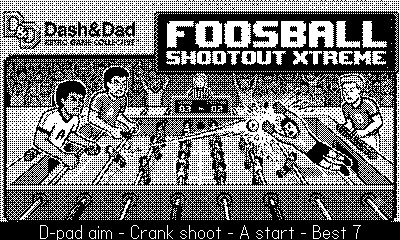

# Dash & Dad Playdate

Playdate games built by a dad and his kid ("Dash"), and the shared know-how
behind them.



## Games

### 🥅 [Foosball Shootout](games/foosball)

An arcade foosball shootout. Slide to line up with the incoming ball, tip your
foosball man with the crank, and flick it past the goalie. Endless streak mode —
the goalie gets tougher the longer your streak runs.

### 🔭 [Submariner](games/submariner)

An ambient submarine periscope toy. Sweep the horizon with the d-pad, raise and
lower the scope with the crank, and play an endless game of I Spy — or just
ignore the prompts and watch the sea.

## Layout

```
games/          one self-contained Playdate game per directory
docs/playdate/  shared Playdate development notes — read before hacking on a game
```

Each game has its own `README.md`, `CLAUDE.md`, `Makefile`, and tests, and
builds on its own.

## Build

Requires the [Playdate SDK](https://play.date/dev/) at `~/Developer/PlaydateSDK`.

```
cd games/<name>
make build   # compile the .pdx
make run     # build and launch in the Simulator
```

To play on a device, build then sideload the `.pdx` via the simulator
(Device menu) or [play.date/account](https://play.date/account/).

## License

Released into the public domain under [the Unlicense](LICENSE).
